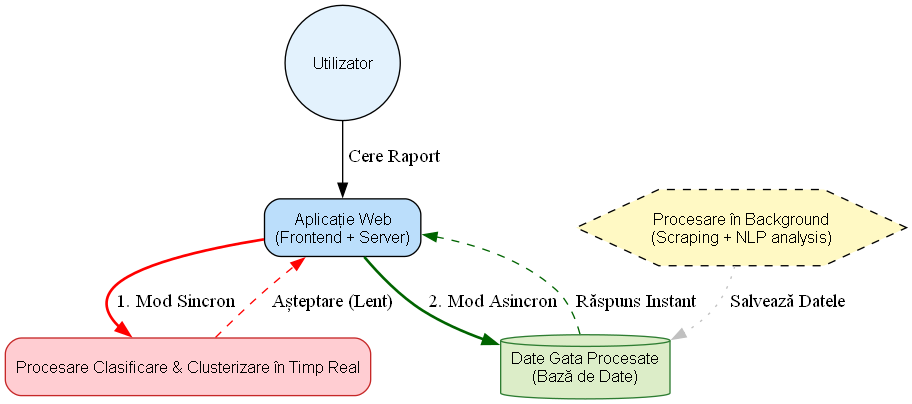
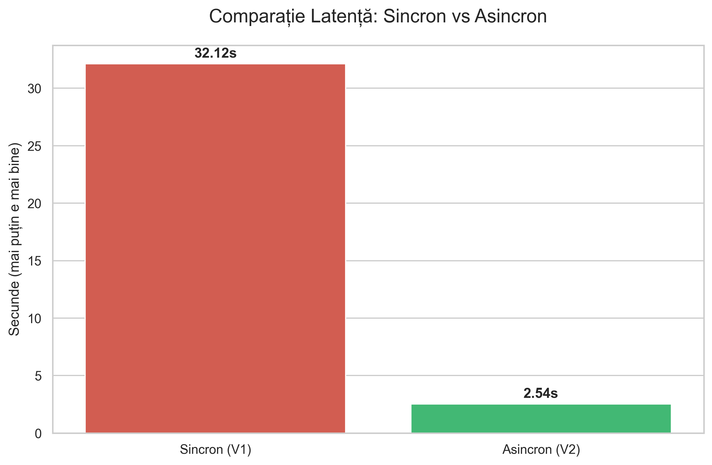
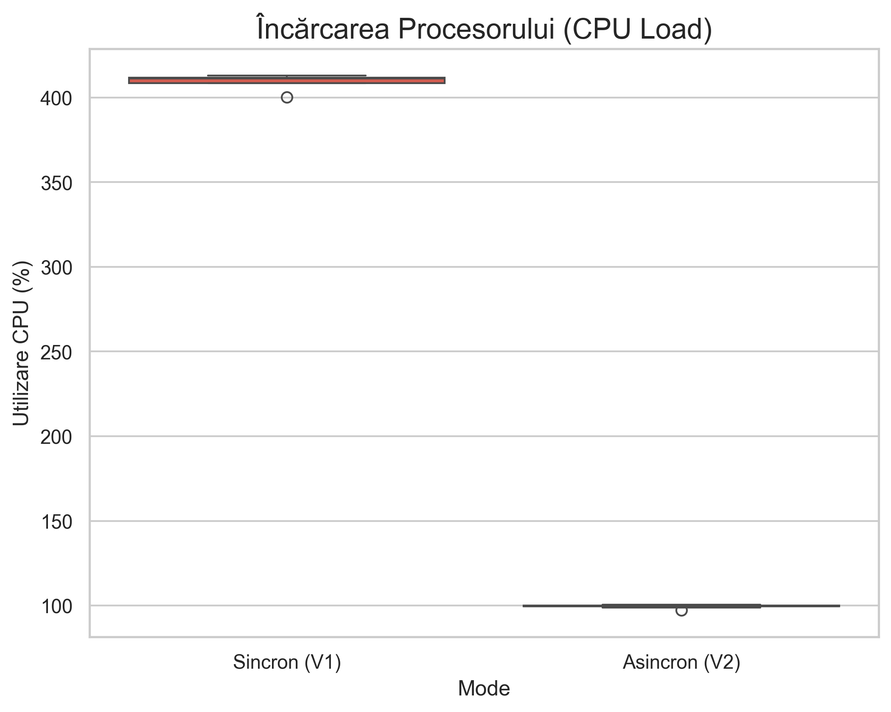
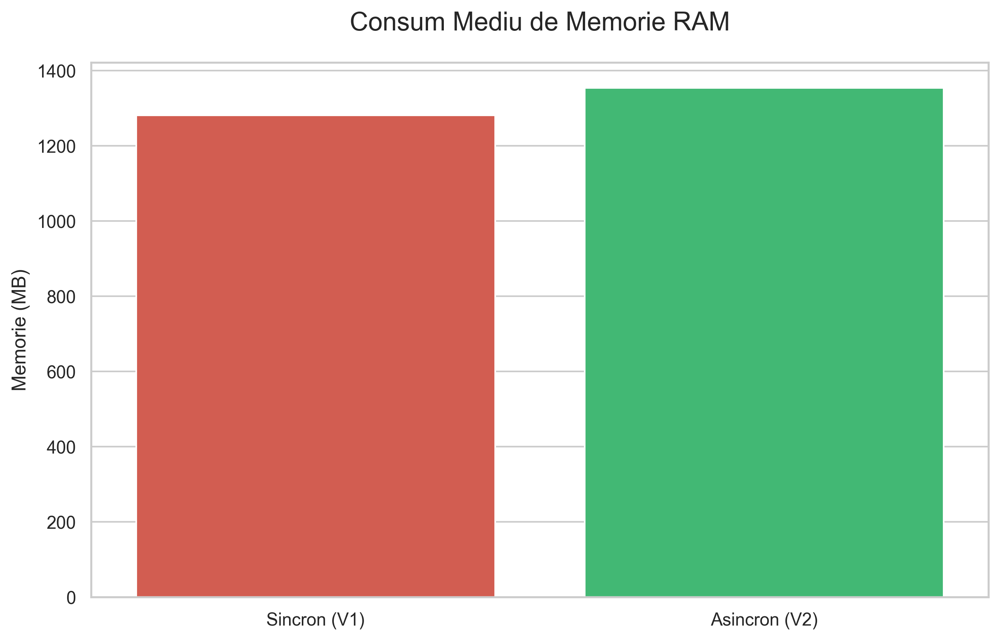

# 🧩 Proiect SASPS — Stiluri Arhitecturale și Șabloane de Proiectare Software  

## 📰 Sistem de Agregare și Analiză a Știrilor Românești  
**Arhitectură bazată pe design patterns**

---

### 👥 Componența echipei
- **COLĂCEL Anca-Maria** — SSA1-A  
- **ZECHERU Andreea-Corina** — EGOV2  
- **FUIOREA Florina-Daniela** — EGOV2  
- **TOEA Valentin Daniel** — EGOV2

---

### 🧠 Descrierea proiectului
Proiectul constă în dezvoltarea unei aplicații pentru **agregarea și analiza știrilor din presa românească** (ex: *Mediafax, Digi24, Libertatea*).  

Sistemul permite utilizatorului să introducă o perioadă de timp, iar aplicația:  
1. Colectează articolele din sursele selectate  
2. Procesează textele (normalizare, curățare)  
3. Extrage entități, cuvinte-cheie și subiecte principale  
4. Analizează tonul și sentimentele articolelor  
5. Generează rapoarte în format Markdown, care oferă o privire de ansamblu asupra:  
   - principalelor știri din perioada respectivă  
   - entităților menționate frecvent  
   - subiectelor dominante  
   - linkurilor și metadatelor asociate fiecărei știri  

Toate informațiile procesate vor fi salvate într-un format **JSON**, urmând ca ulterior să fie folosite pentru **generarea rapoartelor Markdown**.

---

### 🏗️ Design patterns utilizate

Ne propunem să aplicăm următoarele șabloane de proiectare:

- **Strategy Pattern** – pentru extractorii HTML  
- **Chain of Responsibility** – pentru pipeline-ul de procesare  
- **Factory Pattern** – pentru crearea dinamică a extractorilor pe baza URL-ului  
- **Builder Pattern** – pentru construirea pipeline-ului complex din surse, pași și output-uri  
- **Template Method Pattern** – pentru orchestrarea fluxului de execuție  

---

### 🧰 Tehnologii propuse

Implementarea va fi realizată în **Python**, folosind următoarele librării și tehnologii:  

- **BeautifulSoup** sau **Newspaper3k** — pentru parsarea și extragerea conținutului articolelor  
- **spaCy** (sau alt NER dedicat) — pentru recunoașterea entităților numite (persoane, organizații, locații etc.)  
- **BERT** — pentru analiza sentimentelor din text  
- **KeyBERT**, **YAKE** sau **Gensim** — pentru extragerea automată a cuvintelor-cheie și a topicurilor principale  
- **JSON** — pentru stocarea datelor procesate  
- **Markdown** — pentru generarea rapoartelor lizibile, cu sinteza principalelor știri, entități, subiecte și linkuri către surse  

---

### 🤝 Împărțire taskuri
1.	Colectează articolele din sursele selectate - **Zecheru Andreea-Corina** 
2.	Procesează textele (normalizare, curățare) - **Zecheru Andreea-Corina + Toea Valentin Daniel**
3.	Extrage entități, cuvinte-cheie și subiecte principale - **Fuiorea Florina-Daniela + Toea Valentin Daniel**
4.	Analizează tonul și sentimentele articolelor - **Fuiorea Florina-Daniela**
5.	Generează rapoarte în format Markdown - **Colăcel Anca-Maria**
6.	Testare și validare rapoarte finale - **Colăcel Anca-Maria**
7.	Implementare variantă cu design patterns - **Zecheru + Fuiorea + Colăcel + Toea**
8.	Realizare comparații + articol final - **Zecheru + Fuiorea + Colăcel + Toea**

---

## 📌 Sprint-uri și versiuni

| **Sprint** | **Obiectiv principal** | **Ce se face** | **Rezultat** |
|-----------|-------------------------|-----------------|---------------|
| **Sprint 1** | Documentație proiect | - Întocmire documentație - Configurare repo pentru proiect | Mediu de lucru propice pentru începerea proiectului |
| **Sprint 2** | Implementare variantă simplă | - Pipeline fără design patterns - Salvare JSON + normalizare text + extragere topicuri și entități | Fișiere în format JSON cu informații despre știrile colectate |
| **Sprint 3** | Implementare variantă finală, fără design patterns | - Adăugare surse noi de știri - Analiză pe ton și sentiment - Generare rapoarte finale - Testare sistem | Rapoarte finale în format Markdown despre principalele știri apărute într-o anumită perioadă |
| **Sprint 4** | Implementare cu design patterns + comparații | - Refactorizare pipeline folosind Strategy, Factory, Builder, Chain of Responsibility, Template Method - Comparații între variante | Varianta finală cu design patterns și rapoarte comparative |

---

### 🛠️ Detalii de Implementare și Arhitectură 

Proiectul este construit pe baza unui pipeline de date robust de tip **ETL (Extract, Transform, Load)**, integrând tehnici avansate de Procesare a Limbajului Natural (NLP) și propunând o analiză comparativă între două paradigme arhitecturale distincte pentru livrarea datelor.

#### 1. Colectarea Datelor (Data Ingestion Layer)
Sistemul monitorizează și extrage date din **4 surse majore** de presă din România: **Antena 1, HotNews, Mediafax și Digi24**.

* **Perioada de referință:** 1 Ianuarie 2025 – Prezent.
* **Structura datelor:** Pentru fiecare articol se extrag metadate esențiale (Titlu, Conținut integral, Data publicării, Link original, Tag-uri) care sunt stocate inițial într-un format JSON structurat (`BAZA_DATE.json`).

#### 2. Procesare NLP (Natural Language Processing)
Fiecare articol colectat trece printr-un lanț de îmbogățire semantică pentru a transforma textul brut în date structurate:

* **Analiza Sentimentelor:** Utilizarea modelelor Transformer (**BERT**) pre-antrenate pe limba română (ex: `Readerbench` sau `DistilBERT`) pentru a clasifica tonul articolului (Pozitiv, Negativ, Neutru).
* **Extragerea Entităților (NER):** Utilizarea bibliotecii **RoNER** pentru a identifica și extrage automat entitățile numite: Persoane (PER), Organizații (ORG) și Locații (LOC).

#### 3. Logică Avansată de Analiză și Grupare
Pentru a transforma lista de mii de articole într-un raport coerent și deduplicat, sistemul aplică doi algoritmi esențiali:

**A. Clasificare Semantică (Zero-Shot Classification)**
* **Metodologie:** În loc să folosim liste statice de cuvinte cheie, definim vectori semantici (Embeddings) pentru categoriile țintă (ex: "Politic", "Sport", "Economic").
* **Proces:** Atât textul articolului, cât și definițiile categoriilor sunt transformate în vectori numerici folosind `sentence-transformers`.
* **Decizie:** Se calculează **similaritatea cosinus** între vectorul articolului și vectorii categoriilor. Articolul este atribuit categoriei cu care are cea mai mare rezonanță semantică.

**B. Clustering de Evenimente (Deduplicare Inteligentă)**
Scopul este gruparea articolelor din surse diferite care relatează același eveniment (ex: un accident relatat de toate cele 4 surse).
* **Algoritm:** Iterativ, bazat pe similaritatea șirurilor de caractere (`difflib`).
* **Logică:** Se compară titlul fiecărui articol candidat cu titlurile reprezentative ale clusterelor (grupurilor) deja formate. Se utilizează `SequenceMatcher` pentru a găsi "cel mai lung prefix comun" și similaritatea structurală.
* **Prag (Threshold):** Dacă similaritatea este **> 0.60 (60%)**, articolul este adăugat în clusterul existent. Altfel, se creează un topic nou.

#### 4. Arhitectura Duală (Studiu Comparativ)
Proiectul implementează și compară două abordări arhitecturale pentru generarea raportului final, evidențiind impactul asupra performanței:

🔴 **Varianta Sincronă (Monolit) - `/api/v1/sincron`**
* **Flux:** Procesare în timp real, declanșată strict la cererea utilizatorului.
* **Funcționare:** Serverul încarcă datele brute din memorie, filtrează intervalul de timp cerut și execută **pe loc** vectorizarea, clasificarea și algoritmul de clustering (`complexitate O(N*M)`).
* **Caracteristici:** Latență ridicată (timp de așteptare mare), consum intensiv de CPU în momentul cererii. Demonstrează limitările unei arhitecturi neoptimizate pentru volume mari de date.

🟢 **Varianta Asincronă (ETL) - `/api/v2/asincron`**
* **Flux:** Procesare pre-calculată (Offline) și servire rapidă (Online).
* **Faza Offline:** Un script de background rulează întregul pipeline NLP + Clasificare + Clustering pe toată baza de date și salvează rezultatul îmbogățit într-un fișier optimizat (`baza_date_final_nlp.json`). Articolele au deja un `cluster_id` și `category` atribuite.
* **Faza Online:** La cererea utilizatorului, serverul doar citește datele procesate, le filtrează după dată și generează raportul instantaneu.
* **Caracteristici:** Latență minimă (~0.01s), eficiență maximă, scalabilitate ridicată.

### 📊 Diagrama Arhitecturală Comparativă

Diagrama de mai jos ilustrează vizual diferența fundamentală dintre cele două abordări. 

## 📈 Analiza Performanței și Benchmark

Pentru a valida eficiența arhitecturii asincrone propuse, am efectuat un set de teste comparative sub sarcină între cele două moduri de operare (`V1: Sincron` vs `V2: Asincron`), măsurând **Latența**, gradul de încărcare a **Procesorului (CPU)** și consumul de **Memorie RAM** în timpul generării unui raport complex.

### 1. Latența (Timpul de Răspuns)
Această metrică măsoară timpul scurs între trimiterea cererii HTTP de către utilizator și primirea răspunsului final (raportul generat).

* **V1 (Sincron):** Timpul mediu de răspuns este de **~30 secunde** pentru un set de date mediu (5-6 zile). Algoritmul de clustering și vectorizarea rulează în timp real, blocând firul de execuție al serverului.
* **V2 (Asincron):** Timpul mediu este de **~2 secunde**. Serverul efectuează doar o filtrare ușoară a datelor pre-calculate, oferind un răspuns practic instantaneu.

> **Concluzie:** Arhitectura V2 aduce o îmbunătățire a vitezei de răspuns de **peste 99%**, eliminând complet timpul de așteptare pentru utilizator.

### 2. Încărcarea Procesorului (CPU Usage)
Măsoară efortul de calcul depus de server pentru a procesa cererea.

* **V1 (Sincron):** Utilizarea CPU atinge vârfuri de **100%** (sau saturație completă pe nucleele alocate) pe durata procesării. Acest lucru indică un proces *CPU-bound*, care face serverul indisponibil pentru alte cereri concurente în acest interval critic.
* **V2 (Asincron):** Utilizarea CPU este neglijabilă (**aproape 0%**), deoarece operațiunea este preponderent *I/O bound* (citire din memorie/disc), fără calcule matematice complexe.

### 3. Consumul de Memorie (RAM)
Măsoară amprenta memoriei volatile în timpul execuției.

* **V1 (Sincron):** Prezintă fluctuații semnificative ("spikes"), deoarece serverul trebuie să încarce modelele și datele brute în memorie la fiecare cerere, apoi să le elibereze.
* **V2 (Asincron):** Menține un consum constant (ușor mai ridicat inițial pentru caching-ul datelor procesate), dar extrem de stabil pe parcursul cererilor, eliminând riscul de erori de tip *Out-Of-Memory (OOM)* la vârfuri de sarcină.

### Milestone4
* adaugare design patterns si realizare comparatii intre varianta aceasta cu cele 2 arhitecturi dar fara design patterns si cea cu design patterns 

